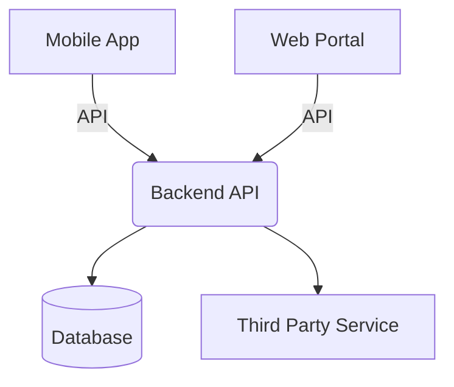
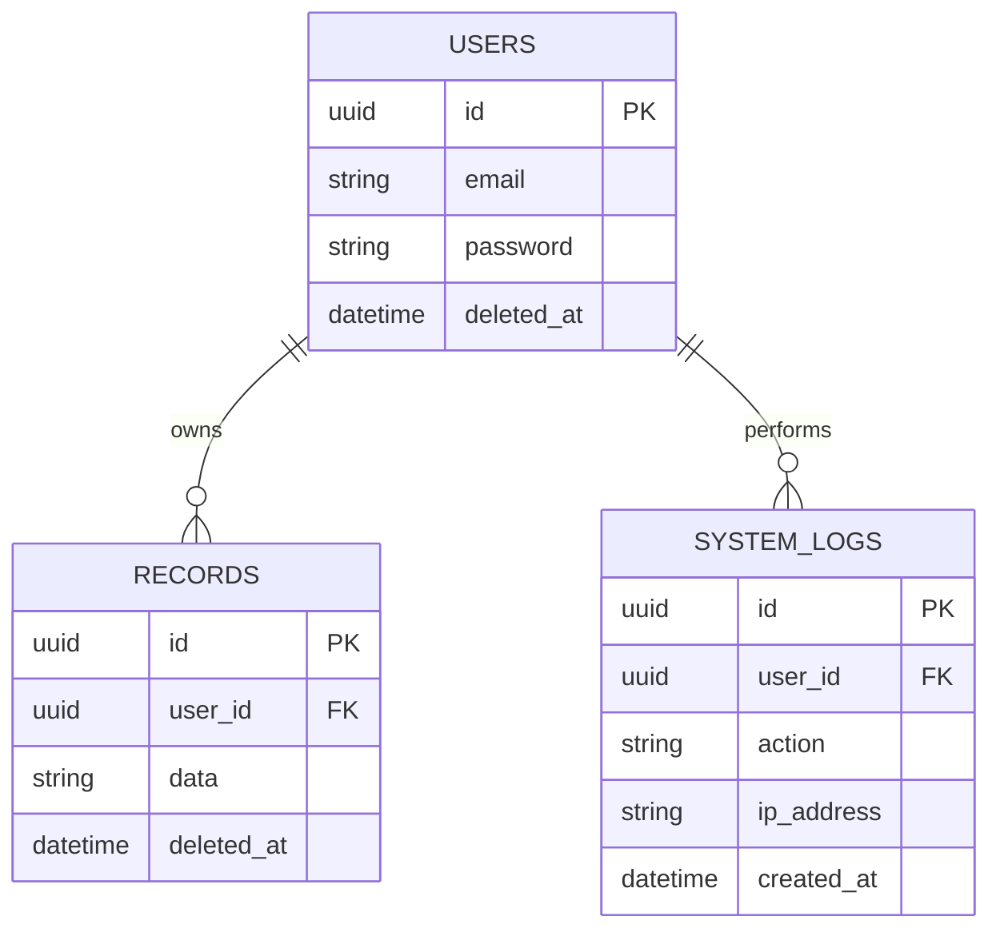

# Phase 3: System Architecture & ERD

> **CRITICAL RULE:** This document is the blueprint for the Engineering Team. It must be finalized before any coding begins. It MUST include concrete Mermaid diagrams, field data types, external integration points, and version control strategies.

---

## 1. Technology Stack & Implementation Details
- **Frontend:** [e.g., React 18 / Next.js. Describe build and hosting logic.]
- **Mobile:** [e.g., Flutter / React Native. Describe offline capability if applicable.]
- **Backend:** [e.g., Node.js / Express.js / PHP]
- **Database:** [e.g., MySQL / PostgreSQL / SQLite]
- **Infrastructure:** [e.g., AWS EC2, Nginx, PM2, Docker]

## 2. System Architecture Diagram
*Provide a high-level component interaction diagram using Mermaid.js.*

## 3. Database Entity Relationship Diagram (ERD)
*Provide an ERD diagram detailing exact table names and relationships. **MANDATORY:** Must include a `system_logs` or `audit` table, and all core tables must implement `deleted_at`.*

## 4. Core Tables & Archiving Strategy
*Describe the detailed columns and SQL Data Types for the core tables. Explicitly define the archiving strategy for high-volume tables.*
- **`users`**: `id` (UUID PK), `email` (VARCHAR UNIQUE), `deleted_at` (DATETIME NULL).
- **`system_logs`**: `id` (UUID PK), `action` (VARCHAR), `created_at` (DATETIME).
- **Archiving Strategy:** e.g., `system_logs` older than 90 days are automatically migrated to `system_logs_archive` via a weekly cron job.

## 5. API Core Endpoints & Integrations
| Method | Endpoint | Description | Auth Required? |
|--------|----------|-------------|----------------|
| POST   | `/api/v1/auth/login` | Authenticate user | No |
| GET    | `/api/v1/users/me` | Get profile | Yes |

## 6. Integration Points & External APIs
*List any third-party services the system integrates with, including billing and webhook details.*
- [e.g., Stripe API, Twilio SMS, Google Maps API]

## 7. Scalability, Performance & Version Control
- **Version Control & CI/CD:** [e.g., Git flow, GitHub Actions, custom Bash deployment scripts.]
- **System Updates:** [e.g., Zero-downtime deployments via PM2 reload.]
- **Scalability Considerations:** [e.g., Database read replicas, load balancer requirements.]

## 8. Detailed Security Mechanisms
- **SQL Injection Prevention:** [e.g., Strict use of parameterized prepared statements or Prisma ORM.]
- **Data Protection (In-Transit & At-Rest):** [e.g., Enforced TLS 1.3, bcrypt hashing for passwords.]
- **Authentication & Rate Limiting:** [e.g., JWT token expiration limits, IP-based request throttling.]

---
**Sign-off:**
- [ ] Solution Architect
- [ ] Lead Developer
