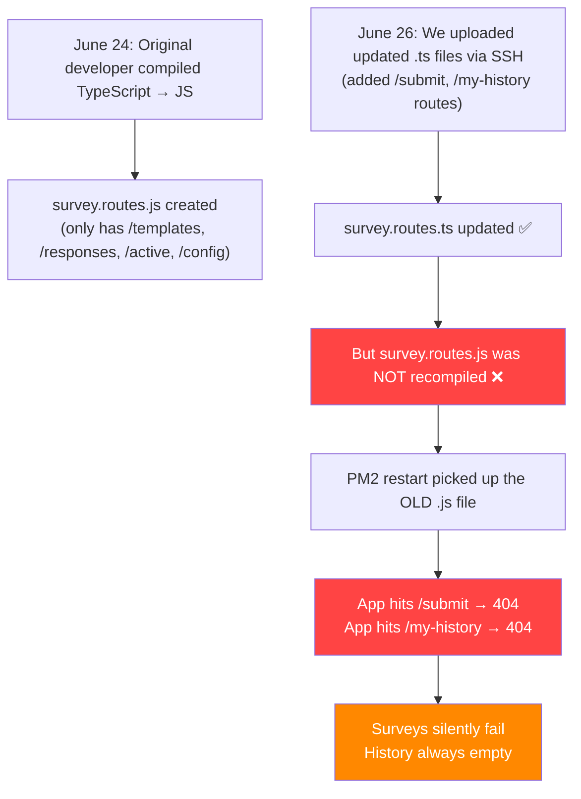

# Bug Report: Survey Submissions Not Syncing & History Empty

> **Severity:** 🔴 Critical  
> **Date Discovered:** June 29, 2026  
> **Date Fixed:** June 29, 2026  
> **Affected Component:** Backend Server (`demo.bloomix.io`) → PM2 Process  
> **Reported By:** Client (via boss)

---

## Symptoms

1. The client completed surveys in the mobile app and tapped **Sync**, but the surveys never appeared in the **History** screen.
2. No error messages were shown to the user — the failure was completely silent.
3. Login and shop data syncing worked fine — only survey submission and history retrieval were broken.

---

## Investigation

### Step 1: Check Server Health

Connected to the remote server via SSH and verified:

- ✅ PM2 process `atsolar_api` was **online** and running
- ✅ MySQL database was up and all tables existed (`User`, `SurveyResponse`, `SurveyTemplate`, etc.)
- ✅ Login endpoint (`POST /api/v1/auth/login`) returned a valid JWT token
- ✅ Active survey endpoint (`GET /api/v1/surveys/active`) returned the correct survey schema

### Step 2: Test the Failing Endpoints

Tested the two endpoints the mobile app uses for survey sync:

| Endpoint | Expected | Actual Result |
|----------|----------|---------------|
| `POST /api/v1/surveys/submit` | `{ success: true, data: {...} }` | ❌ `Cannot POST /api/v1/surveys/submit` (404) |
| `GET /api/v1/surveys/my-history` | `{ success: true, data: [...] }` | ❌ `Cannot GET /api/v1/surveys/my-history` (404) |

Both endpoints returned **404 — route not found**. The routes simply didn't exist on the running server.

### Step 3: Identify Root Cause

Checked how PM2 was configured to run the app:

```
pm2 describe atsolar_api

│ script path  │ /applications/atsolar_backend/src/index.js │
│ interpreter  │ node                                       │
```

> [!CAUTION]
> PM2 was running the **compiled JavaScript** file (`index.js`), NOT the TypeScript source via `ts-node`.

Then checked whether the compiled `survey.routes.js` had the required routes:

```bash
# Check compiled JS (what PM2 actually runs)
grep "submit\|my-history" src/routes/survey.routes.js
# Result: NOTHING FOUND ❌

# Check TypeScript source (what we uploaded)
grep "submit\|my-history" src/routes/survey.routes.ts
# Result:
# 129: router.post('/submit', ...)    ✅
# 164: router.get('/my-history', ...) ✅
```

### Step 4: Confirm File Dates

| File | Last Modified | Contains `/submit`? | Contains `/my-history`? |
|------|--------------|---------------------|------------------------|
| `survey.routes.js` (compiled) | **June 24** | ❌ No | ❌ No |
| `survey.routes.ts` (source) | **June 26** | ✅ Yes | ✅ Yes |

---

## Root Cause



**In simple terms:** PM2 on the server runs compiled JavaScript (`.js`), not TypeScript (`.ts`). When we deployed updated TypeScript files on June 26, we forgot to recompile them. So PM2 kept running the old June 24 compiled code, which didn't have the survey submission or history endpoints.

---

## The Fix

### Commands Executed on Remote Server

```bash
# 1. Recompile TypeScript to JavaScript
cd /applications/atsolar_backend && npx tsc

# 2. Verify the compiled JS now has the routes
grep "submit\|my-history" src/routes/survey.routes.js
# Output:
# 129: router.post('/submit', ...)    ✅
# 162: router.get('/my-history', ...) ✅

# 3. Restart PM2 to pick up the new compiled code
pm2 restart atsolar_api
```

### Verification

After the fix, ran a full end-to-end test from the server:

```
=== Testing /surveys/my-history ===
HISTORY: {"success":true,"data":[]}         ✅ (empty but working — no surveys yet)

=== Testing /surveys/submit ===
SUBMIT: {"success":true,"data":{"id":1,"templateId":9,"shopId":1,
         "userId":2,"status":"completed"}}   ✅ Survey saved!

=== Re-checking history after submit ===
HISTORY: {"success":true,"data":[{"id":1,"surveyId":9,"shopId":1,
         "shopName":"Mobile Zone Blue Area","surveyTitle":"TSO Survey",
         "submittedAt":"2026-06-29T06:36:00.029Z"}]}   ✅ History populated!
```

---

## Why the App Didn't Show an Error

The mobile app uses an **offline-first** architecture:

1. When the user completes a survey, it's saved to a **local SQLite** database (`pending_responses` table)
2. When the user taps **Sync**, the app tries to push pending surveys to the server
3. If the push fails (404), the error is caught silently — the survey stays in the local queue for retry
4. The app then fetches history from `/my-history` — which also returns 404, so history stays empty

The user sees no error because the app is designed to silently retry on the next sync. But since the route never existed on the server, retrying forever wouldn't help.

---

## Prevention: Future Deployment Checklist

> [!IMPORTANT]
> **Always follow this sequence when deploying backend changes to the demo server:**

```bash
# 1. Upload files (excluding node_modules and .env)
rsync -avz --exclude 'node_modules' --exclude '.env' \
  -e "ssh -p 2722" backend/ \
  master-94099776@172.104.130.208:/applications/atsolar_backend/

# 2. Install any new dependencies
ssh -p 2722 master-94099776@172.104.130.208 \
  "cd /applications/atsolar_backend && npm install"

# 3. ⚠️ CRITICAL: Recompile TypeScript
ssh -p 2722 master-94099776@172.104.130.208 \
  "cd /applications/atsolar_backend && npx tsc"

# 4. Sync database schema (if schema.prisma changed)
ssh -p 2722 master-94099776@172.104.130.208 \
  "cd /applications/atsolar_backend && npx prisma db push"

# 5. Restart the PM2 process
ssh -p 2722 master-94099776@172.104.130.208 \
  "pm2 restart atsolar_api"
```

> [!WARNING]
> **Step 3 (`npx tsc`) is the one that was missed and caused this bug.** Skipping it means PM2 will keep running stale compiled code even after you upload new TypeScript files.

---

## Files Involved

| File | Location | Role |
|------|----------|------|
| [survey.routes.ts](file:///c:/Users/HP/.gemini/antigravity/scratch/AdvanceTelecom/Zainab_Handover/backend/src/routes/survey.routes.ts) | Backend | Contains `/submit` and `/my-history` route handlers |
| [background_sync_service.dart](file:///c:/Users/HP/.gemini/antigravity/scratch/AdvanceTelecom/Zainab_Handover/advance_telecom_app/lib/services/background_sync_service.dart) | Mobile App | Pushes pending surveys to `POST /surveys/submit` |
| [sync_engine.dart](file:///c:/Users/HP/.gemini/antigravity/scratch/AdvanceTelecom/Zainab_Handover/advance_telecom_app/lib/services/sync_engine.dart) | Mobile App | Fetches history from `GET /surveys/my-history` |
| [return_to_owner.md](file:///c:/Users/HP/.gemini/antigravity/scratch/AdvanceTelecom/Zainab_Handover/return_to_owner.md) | Project Root | Change log updated with this fix |
